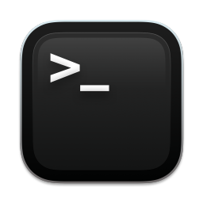
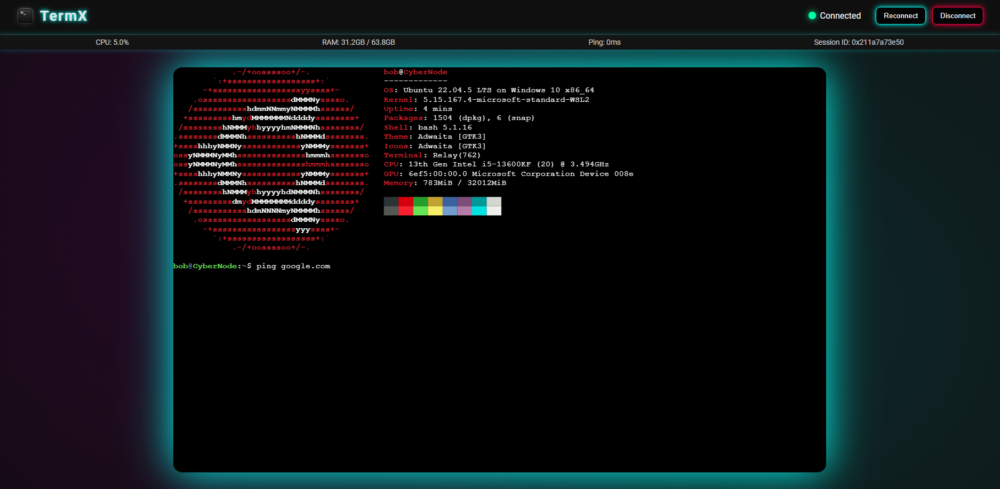

<p align="center">
  
</p>

**TermX** is a fully functional web-based terminal application powered by **Xterm.js** **FastAPI** and **Socket.IO**. This project allows you to run terminal commands inside your browser with real-time updates and an interactive experience.

---

## 🎨 Features

- **Cross-Platform Support**: Works on **Linux**, **MacOS**, and **Windows**.
- **Real-time Updates**: Display system stats (CPU, RAM, etc.) and terminal output.
- **Interactive Terminal**: Run terminal commands like `bash` (Linux) or `cmd.exe` (Windows) from the web.
- **Resizable Terminal**: Dynamically resize your terminal window.
- **Custom Commands**: Pass custom commands and arguments to be run in the terminal.

---

## 🧑‍💻 Usage

1. **Clone the repository**:
   ```bash
   git clone https://github.com/excho0/TermX.git
   cd TermX
   ```

2. **Create and activate a virtual environment** **```(recommended)```** :
   ```bash
   python3 -m venv termx
   source termx/bin/activate  # On Windows, use 'termx\Scripts\activate'
   ```

3. **Install the required dependencies**:
   ```bash
   pip install -r requirements.txt
   ```

4. **Run the application**:
   ```bash
   python main.py
   ```

5. Open your browser and navigate to `http://localhost:5000` (or replace `localhost` with your server IP).

---

## 🔧 Command-Line Options

- `--port` : Specify the port to run the server (default: `5000`).
- `--host` : Specify the host to run the server (default: `0.0.0.0`).
- `--debug` : Enable debug mode for detailed logs.
- `--version` : Print the version of the application and exit.
- `--command` : Define the terminal command to run (default: `bash` for Linux, `cmd.exe` for Windows).
- `--cmd-args` : Provide arguments to pass to the terminal command.

Example:
```bash
python main.py --port 8080 --command "bash" --cmd-args "-c 'echo Hello, World!'"
```

---

## 📸 UI Showcase

<p align="center">
  
</p>

---

## ⚡ How It Works

TermX leverages **FastAPI** as the backend server and **Socket.IO** for real-time bidirectional communication between the frontend and the backend. The terminal is powered by **PTY** (Pseudo Terminal) for Unix-like systems or **pywinpty** (ConPTY) for Windows.

- The terminal runs inside a **child process** created using **fork()** (for Unix-like systems) or **pywinpty** (for Windows).
- The terminal's output is captured and streamed to the browser in real-time.
- Users can send input to the terminal, resize the terminal window, and view system metrics.

---

## 🧑‍💻 Contributing

We welcome contributions! If you'd like to help improve TermX, you can:

- Report bugs and issues
- Open pull requests with improvements

Feel free to fork this repository and submit a pull request!

---

## 📜 License

TermX is licensed under the **MIT License**. See [LICENSE](LICENSE) for more details.

---


<p align="center">
  <i>Made with ❤️ by @excho0</i>
</p>
